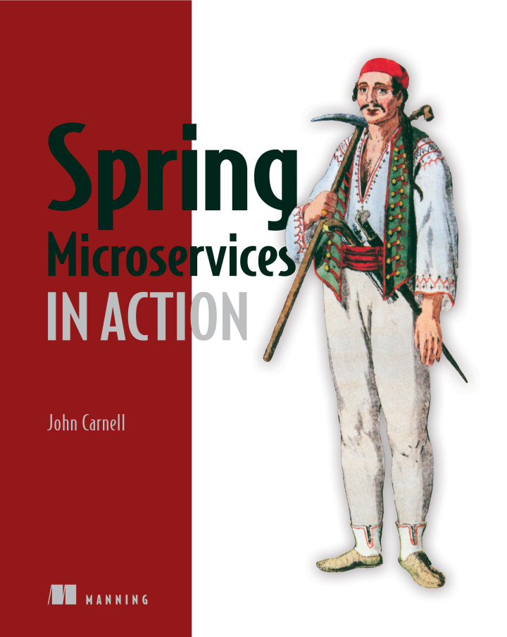
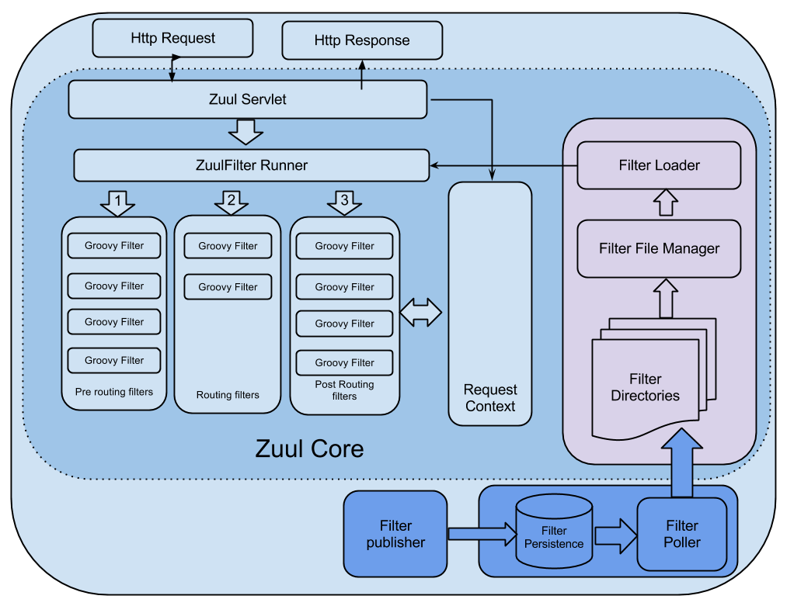
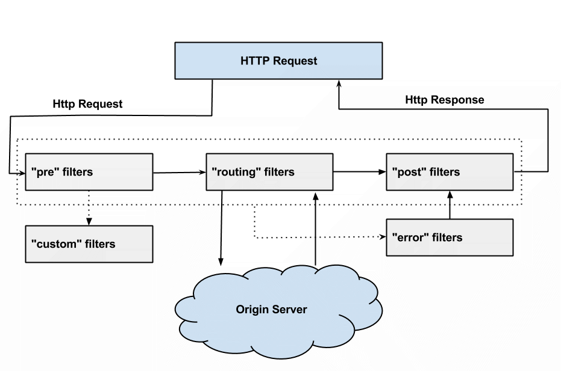
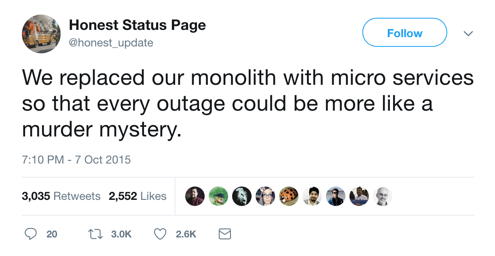
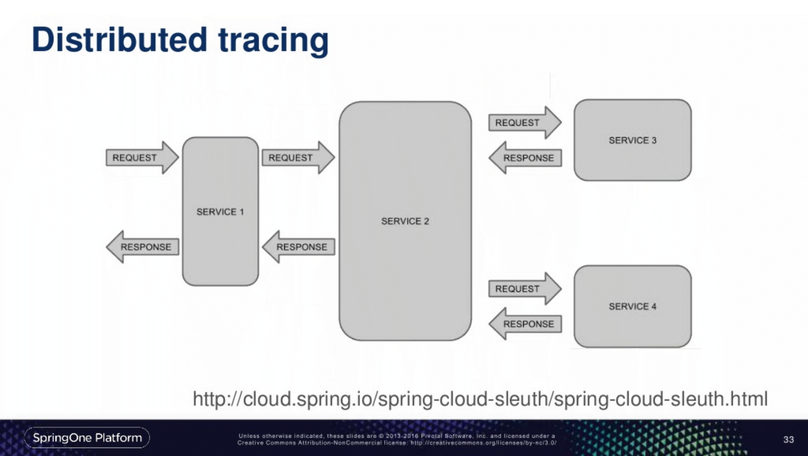
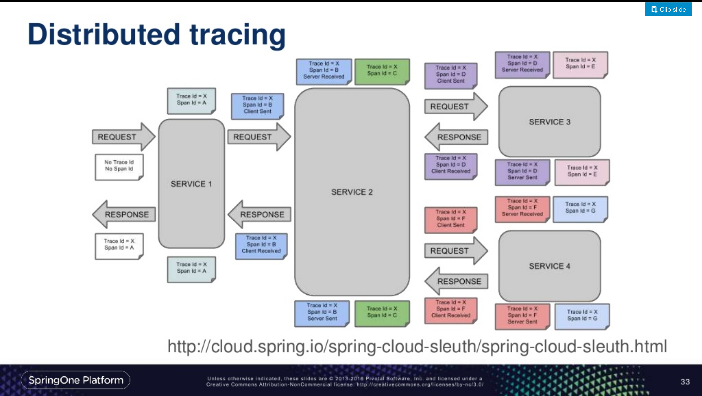

# I read a book

---



---

# John Carnell

is a senior cloud engineer at Genesys, where he works in Genesys’s PureCloud division. John spends the majority of his day hands-on building telephony-based microservices using the AWS platform. His day-to-day job centers on designing and building microservices across a number of technology platforms including Java, Clojure, and Go.

---

# What is Spring Cloud?

---

> Collection of open source tools and libraries that solve common cloud problems

---

* Routing
* Distributed log tracing
* Service discovery
* Distributed configuration

---

# Routing

---

# Zuul


---

# Why

* Allows you to hide service destinations behind a context path
* Dynamically re-route requests based on their payload
* Authentication and authorization
* Metrics and logging

---



---

# Used in Member Web today!

* Zuul replaced a custom written proxy
* New Document Centre required multipart HTTP requests
* We also created a Zuul Filter which determines outage period

---

# Filters



---

# Demo

---

# Service Discovery

---

* Server which acts as a registry for all services
* Client which knows how to register itself

---

* Detects when a service is down and takes it out of the pool
* Integrates with Zuul so newly registered instances can be routed to

---

# Demo

---

# Distributed Log Tracing

---



---

# Terminology

1. Trace - the entire request processed by a distributed system
2. Span - named timed operation, represents work in a trace

---



---



---

# Sleuth

---

* Adds Trace ID and Span ID to the Slf4j Mapped Diagnostic Context (MDC)
* Instruments REST Template to forward Trace ID to next service

---

# Zipkin

---

* Allows you to visualise a request/response cycle
* Identify latency
* Find out where time is spent

---

# Demo

---

# Cloud Config

---

Store your configurations in:


---

* HTTP service for external configuration
* Fetched by your service on boot
* Can refresh *some* properties without shutting down server
* Handles encryption/decryption of sensitive properties

---

# Refresh Config

```java
@RefreshScope
@Bean
```

```shell
curl actuator/refresh
```

---

# Questions?